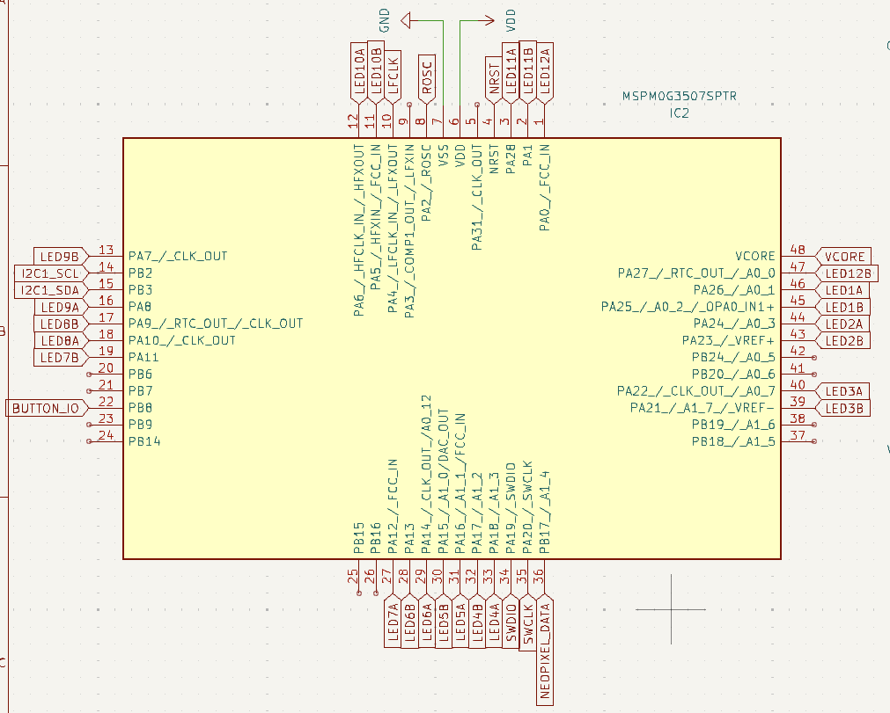

{::options parse_block_html="true" /}

### Lab #1: Intro C Programming (100 pts)

<div class="alert alert-info" role="alert">
#### **There are three goals for this assignment:**


  - To get a taste for writing embedded code in the C programming language. 
  - To build a mental understanding for how GPIO works in the MSPMO+. 
  - To practice writing code for a custom PCB.
  
</div>

<div class="alert alert-danger" role="alert">
#### Due Date: Friday, January 23, 2026

We will do peer grading in class on Monday January 26, 2026, design and code will be assessed according
to the rubric described below. 

#### **What should be turned in?**

  1. A document in TXT or PDF format explaining your design. This might also include a diagram.
  2. Your **commented** code files.

#### **Textbook**

Chapter 2 of the the textbook has an extensive discussion of the GPIO interface.

</div>


#### The Task

You have been given a PCB designed by another engineer. The PCB is intended to function as a clock.
In future labs, we will focus on ensuring precise timing; in this lab your goal is to correctly
initialize the hardware and implement the passage of time.

The outer LED ring is intended to mark hours, and the inner ring is intended to mark minutes. On
the PCB design, these are labeled LEDA12, LEDA1, ..., LEDA11 (hours / outer ring) and 
LEDB12, LEDB1, ..., LEDB11 (seconds / inner ring).

The full KiCad project is available in the git repository in the [PCBs/Clock directory](https://github.com/ckemere/ELEC327/tree/master/PCBs/Clock).
Here is a screenshot of the block showing how the LEDs are connected to the MSPM0 pins.



Note that each pin is labeled with its corresponding GPIO port and number (i.e., LED12A connects to PA0 and
LED7B connects to PA11).


##### 1. Initializing the hardware

As described in class, using simple GPIO requires correctly reseting and configuring several registers.
Specifically, the registers corresponding to the `GPIOA` and `GPIOB` modules, and those corresponding to
the IOMUX.

In class, we used the example of what needs to be configured in order to generate digital signals for the
pin labeled `PA0`. We described 3 basic steps:

   1. Reseting and powering on the GPIOA module
   2. Configuring the IOMUX
   3. Configuring the specific registers to set the value and enable channel 0

For PA0, the code looked like this:

```
/* 1. Reset and power on the GPIOA module */
*GPIOA->GPRCM.RSTCTL = 0xB100003;
*GPIOA->GPRCM.PWREN = 0x2600001;

/* 2. Configure the IOMUX */
IOMUX->SECCFG.PINCM[(IOMUX_PINCM1)] = (IOMUX_PINCM_PC_CONNECTED | ((uint32_t) 0x00000001));

/* 3. Enable channel 0 with a specified initial value of 1
*GPIOA->DOUTSET31_0 = (0x00000001);
*GPIOA->DOESET31_0 = (0x00000001);
```

<div class="alert alert-info" role="alert">
**Active HIGH or Active LOW?**

Why are we initializing the value of the GPIO pin to 1 instead of 0. We want to initialize the
pin so that the LED is inactive. If you open the full schematic, you'll see on the LEDs page that
the anode of the LED is connected to VCC and the cathode is connected to the GPIO pin. This means
that if the pin is digital high (or about VCC), no current will flow, but if the pin is digital low
(or about GND), current WILL flow and the LED will illuminate. So the LEDs are active in the LOW/ZERO
state!
</div>

For each LED, there are TWO things that you need to know in order to make it light up (or turn off) and
ONE ADDITIONAL thing you need to know to initialize it for functionality. What are these three things?

  1. What GPIO peripheral is it connected to? In the case of `PA0`, which is connected to LEDA12 or 
     the 12 o'clock hour hand outer ring, this is `GPIOA`. In the case of LED9B, the peripheral is also
     `GPIOA`. 
  2. What channel of the GPIO is it connected to? In the case of `PA0`, manipulation of the LED is
     accomplished by manipulating the least significant bit in the 32 bit word mapped to GPIOA (bit 0).
     In the case of LED9B, it's connected to `PA7`, so we manipulate the LED by manipulating the eighth bit
     (bit 7). 
  3. What IOMUX table entry controls that output channel? We learn this by looking at Table 6-2 in the
     [datasheet](assets/documents/mspm0g3507.pdf). For `PA0`, this was entry 1. For LED7B (`PA7`), this
     is entry 14. Note that, because our code includes a critical header file (`#include <ti/devices/msp/msp.h>`),
     we have access to a predefined structure, `IOMUX->SECCFG.PINCM[]`, and predefined constants for
     entries into this table like the constant `IOMUX_PINCM1` we used for `PA0`. **NOTE.** In CCS, you
     can right click on an identifier like `IOMUX_PINCM1` and select "Go to Definition", and it will 
     open the header file where it's defined. This is often a helpful way to learn about OTHER useful
     constants that might be predefined for you.


<div class="alert alert-danger" role="alert">
**Checkpoint #0**: Take a look at the schematic. Answer Question #1 for every pin. Do you need to reset 
and power on both  `GPIOA` **and** `GPIOB`? 
<div>

A `Lab1` project has been added to the git repository. It contains a new file, called `initialize_leds.c`
with a corresponding header file, `initialize_leds.h`. The function `InitializeLEDs()` has been prototyped
with the code for `PA0`. You should modify this function so that it properly completes the IOMUX, channel
initialization, and channel enabling for each LED on the board.


<div class="alert alert-info" role="alert">
The IOMUX has a different register for each pin. In addition to enabling the pin (`IOMUX_PINCM_PC_CONNECTED`),
and setting the function (GPIO is function 0x1), there are a bunch of other settings we can configure __for
each pin__.  However, the GPIO pin state (high or low) and output enable are configured by setting/clearing 
individual bits in a 32 bit register. 

**Avoiding Clobbering**

The MSPMO+ includes 3+ commands to manipulate the values of GPIO output enable and output value registers. 
The simplest ones to understand are ones are DOE31_0 and DOUT31_0. These are the full 32 bit register with
one bit corresponding to the enable state / value for each channel. When writing these registers, you need
to be cautious about clobbering, so you should always read-manipulate-write, which you can also accomplish
with the OR-Equal (`|=`) and AND-Not-Equal (`&= ~()`) patterns we talked about in class.

Given that this is potentially always a concern, we have two more registerst that we can use. Writing the 
DOESET31_0 register will only change values from a 0 to a 1, never from a 1 to a zero (it "sets" bits but
doesn't clear them). So the command `GPIOA->DOESET31_0 = 0x00000001;` doesn't actually change the enable
state of any of the channels except channel `PA0`. Simiarly `GPIO->DOECLR31_0 = 0x00000001;` would disable
channel `PA0` but not affect any others. The commands with all zeros (`GPIOA->DOESET31_0 = 0x00000000;` and 
`GPIOA->DOECLR31_0 = 0x00000000;`) have no effect.


**Multiple Lines or One Line**

Thus, in order to accomplish the channel output enable steps, you have a choice. You could do them 
one LED at a time, making sure not to clobber the values:
```
*GPIOA->DOE31_0 = LED12A_bit;
*GPIOA->DOE31_0 |= LED1A_bit; // notice the OR-Equals
*GPIOA->DOE31_0 |= LED2A_bit; // notice the OR-Equals
...
```
Equivalently, you could use the special `DOESET31_0` registers
```
*GPIOA->DOESET31_0 = LED12A_bit;
*GPIOA->DOESET31_0 = LED1A_bit; // regular equals!
*GPIOA->DOESET31_0 = LED2A_bit; // regular equals!
...
```

BUT, nothing requires you to do this in separate lines. This is just as good:
```
*GPIOA->DOESET31_0 = LED12A_bit | LED1A_bit | LED2A_bit | ...;
```

The choice of which to do is really down to which one you can read and understand most clearly when
you come back to maintain it later. (So comments are probably more important than actual code!)

The `DOUT31_0` versus `DOUTSET31_0` choice is identical for initializing the values of the GPIO pins.
</div>

##### 2. Setting/clearing pins for individual LEDs in your code

Once the initialization code is written, you will need to manipulate the state of the LEDs in your
code. As we just discussed, for each GPIO port, this is done by carefully writing to the `DOUT31_0`
register or using the `DOUTSET31_0` or `DOUTCLR31_0` registers.  Only writing the `DOUT31_0` register
will allow you to modify the states of multiple LEDs _in opposite directions_ in one instruction. (*)

##### 3. State machine logic, data structures, etc

Once you are able to control the value of the LEDs as you want, you should implement the logic
of the clock. You should adopt a state machine approach. A very simple variant has been mocked up
in the lab template code, but you should feel free to make this more complex. For example, you
might choose to implement states in a struct array, where each state's entry specifies both the
index of the next state and the value of the output. For another example, you could make the state a tuple
instead of a single int. 


##### Development process

A critical part of any embedded system development project is to work in stages. Ideally each stage tests
specific portions of the code. Once a particular developmental stage is funcitoning correctly, you move on
to the next, more complex stage. A key part of being an embedded developer is to identify the requirements
for each of these stages and to plan your development process. By producing functional code at each step, you
can be confident in the function of the final system.

For this project, we would suggest at least the following 3 preliminary stages. 
  1. **Programming the PCB.** Wire up the PCB to the Launchpad debug section. Program the `blink` project
     and ensure that you see the 12 o'clock LED flashing. __Completion of this stage will give you confidence
     that you understand how to wire up the PCB for programming and that it functions correctly.__
  2. **Initializing the LEDs.** Write your initialization code, and then set the value of all 24 of the LEDs
     to be on. __This at least partially validates your initialization code and ensures that your PCB is
     functional in terms of LEDs being connected to known ports.__
  3. **Make the LEDs Flash in Sequence**. Write code to go through a loop of all of the LEDs one at a time.
     __This will ensure that you have correctly mapped LEDs to GPIO port/channels.__
