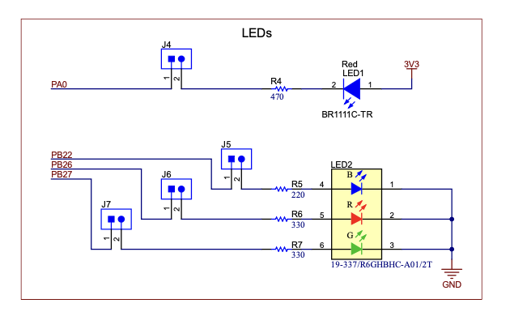

{::options parse_block_html="true" /}

### Lab #2: First Launchpad Project (100 pts)

<div class="alert alert-info" role="alert">
#### **There is one goal for this assignment:**

  - To write your first microcontroller code, interacting with the world via GPIOs
  
</div>

<div class="alert alert-danger" role="alert">
#### Due Date: 1/31/2025
#### **What should be turned in?**

  1. Your **commented** encode_morse.c file. Your grade will be assigned based on
     functionality as defined in the Detailed Specifications below.
  2. **CRITICAL** If you have used hard breakpoints (the `__BKPT(0);` instruction your C
     code) to instrument your code, be aware that I will automatically replace them with
     3 NOP instructions.

</div>

### High level overview

This lab follows the theme begun in [Lab 1](../lab1), except now, instead of using
`printf()` to output text to a terminal screen, you will flash a Morse code message 
on one of the LEDs on your MSPM0 Launchpad. 

The Autograder will be configured to record the digital output of your Launchpad, 
and your grade will be based on the details below. To test precise timing details of
your outputs, we are providing a firmware that you can upload that will display
the duration of on pulses through the serial port.

### Detailed specification

  1. As in Lab 1, the message will be specified as a C-string using the macro 
  `MESSAGE` during compilation. 
  2. (__Simplified alphabet.__) In this lab, dots will again be specified by the `'.'` 
  (period) character and dashes will ONLY be specified by the `'-'` (dash) character, 
  and inter-word gaps will ONLY be specified by the
`';'` (semicolon) characer. 
  3. (__No special cases.__) In addition, you do not need to worry about the special cases 
  from Lab 1 of unspecified characters, or sequences of inter-character and inter-word gaps. 
  (For example, you will never see `";;"`, `" ;"`, `"  "`, or `"; "`). In addition, every 
  message will be concluded with an inter-word character (`";"`).

  **Scoring criteria**
  4. Following the example code, you should set your system oscillator to 32.768 kHz. **(10 pts)**
  5. You should produce the correct output patterns for the 10 test case messages. At the
     end of each message, you should loop infinitely. You may assume that the first character 
     will be either a dot or a dash (not a space). **(50 pts)**
  6. Your code should flash either the blue or red LED on the launchpad. The led color
     will be specified as either `#define REDCOLOR` for red or `#define BLUECOLOR` for blue.
     One or the other will be set, but not both. **(10 pts)**
  7. Your "dot" unit should be roughly 100 ms long, or 3277 clock cycles. **(20 pts)**
  8. Your morse code output should be cycle precise for arbitrary messages. **(10 pts)**
  9. The projects that achieve 100 pts will be ranked based on the time from processor
     reset until the first dot or dash is produced. Bonus points will be assigned 
     based on latency rankings.
  
### Getting started

A Code Composer Studio project which sets up the clocks and initializes the M0+ microcontroller
can be found in the zip file [Lab2.zip](Lab2.zip). Unzip this into your CCS workspace folder,
then use the `Import` command from the `File` menu to add it to your workspace. If everything
is configured properly, you should be able to click the build button and see it compile without
errors. If you click the load button, it should load to your connected Launchpad.

In class, we will go through the process of how we interface to a GPIO in the ARM M0+ family.
Initiallizing the system for a GPIO output involves 5 steps that are described in comments
(but without code) in the `lab2.c` file in the starter project. In addition, we'll talk about
the 3 registers used to effect outputs to GPIOs - `DOUTSET31_0`, `DOUTCLR31_0`, `DOUTTGL31_0`.
Helpful text references for this Lab can be found in Section 2.2 of the textbook 
([Chapter 2](https://users.ece.utexas.edu/~valvano/mspm0/ebook/Ch2_IntroToInterfacing.html) in 
the online version.)

### Measuring the width of pulses
There are two simple ways to measure the duration of the pulses that you are measuring. The first
is to use the debugger and the Systick clock. To enable the Systick, you the following code in 
initialization.
```
    SysTick->CTRL = SysTick_CTRL_CLKSOURCE_Msk;
    SysTick->LOAD = 0x00FFFFFF;
    SysTick->VAL  = 0;
    SysTick->CTRL |= (SysTick_CTRL_CLKSOURCE_Msk | SysTick_CTRL_ENABLE_Msk);
```
When you debug, you will find that the register called `SYSTICK_SYST_CVR` will decrement each
clock cycle. So you can place breakpoints (either using the helper function `__BKPT(0);` or
by clicking in the UI), and then observe how many ticks elapse between raising and lowering
(or lowering and raising) the output pin. Note that executing the breakpoint takes 3 clock
cycles.

Note that the template file configures the processor to run at 32.768 kHz (very slow), and to
output the system clock to a pin. This is required for this lab in order to enable the timining
measurement process to be cycle-accurate. This code in your template file configures the system
clock to be spit out on PA31.
```
void InitializeCLKOut(void) {
    // This function initializes the GPIO so that the system clock is outputed to pin PA31
    GPIOA->GPRCM.RSTCTL = (GPIO_RSTCTL_KEY_UNLOCK_W | GPIO_RSTCTL_RESETSTKYCLR_CLR | GPIO_RSTCTL_RESETASSERT_ASSERT);
    GPIOA->GPRCM.PWREN = (GPIO_PWREN_KEY_UNLOCK_W | GPIO_PWREN_ENABLE_ENABLE);
    delay_cycles(POWER_STARTUP_DELAY); // delay to enable GPIO to turn on and reset
    IOMUX->SECCFG.PINCM[(IOMUX_PINCM6)] = (IOMUX_PINCM_PC_CONNECTED | IOMUX_PINCM6_PF_SYSCTL_CLK_OUT);
    GPIOA->DOESET31_0 = 0x1u<<31; // PA31 is our output pin for the clock
}
```

The second way to measure pulsewidth is to leverage this clock output to count clock cycles. A logic analyzer
would do this easily for you, but since that's not a required purchase for the class, I've written a simple
program which you can find here [https://github.com/ckemere/ELEC327/tree/master/Code/ClockedPulseWidth](https://github.com/ckemere/ELEC327/tree/master/Code/ClockedPulseWidth).
If you load `ClockedPulseWidth.out` onto a friends Launchpad, connect pin PB0 to the clock output pin on your
Morse Code Launcpad (pin PA31) and pin PB16 to the LED driver pin. (To access the LED driver pin, remove the
jumper and connect to the higher pin (which should be PB22 or PB27 for blue or red LED.) When connected, the measurement
Launchpad will create a serial connection to your computer from which you can read a stream of pulse widths.
The program `read_data.py` in the repository will connect and record these data to the pulseslist.txt file
which you can open later.

### Knowing which GPIOs the LED is connected to
If you squint at the Launchpad, you can see the RGB led driver pins labeled. They are also given in the schematic
for the Launchpad, which you can download from the class repository
[https://github.com/ckemere/ELEC327/blob/master/Documents/Launchpad/slar172a/LP-MSPM0G3507_Hardware_Design_Files_V2/MCU098_LP-MSPM0G3507.pdf](https://github.com/ckemere/ELEC327/blob/master/Documents/Launchpad/slar172a/LP-MSPM0G3507_Hardware_Design_Files_V2/MCU098_LP-MSPM0G3507.pdf) 
or [here](https://raw.githubusercontent.com/ckemere/ELEC327/refs/heads/master/Documents/Launchpad/slar172a/LP-MSPM0G3507_Hardware_Design_Files_V2/MCU098_LP-MSPM0G3507.pdf). Here's the relevant part:

<div class="row">
<div class="col-md-6 col-sm-6 col-xs-6">
<figure class="figure">
<a href="Launchpad_Schematic_LED.png"> </a>
<figcaption class="figure-caption"><p>Zoomed in view of RGB LED in schematic</p></figcaption>
</figure>
</div>
</div>
