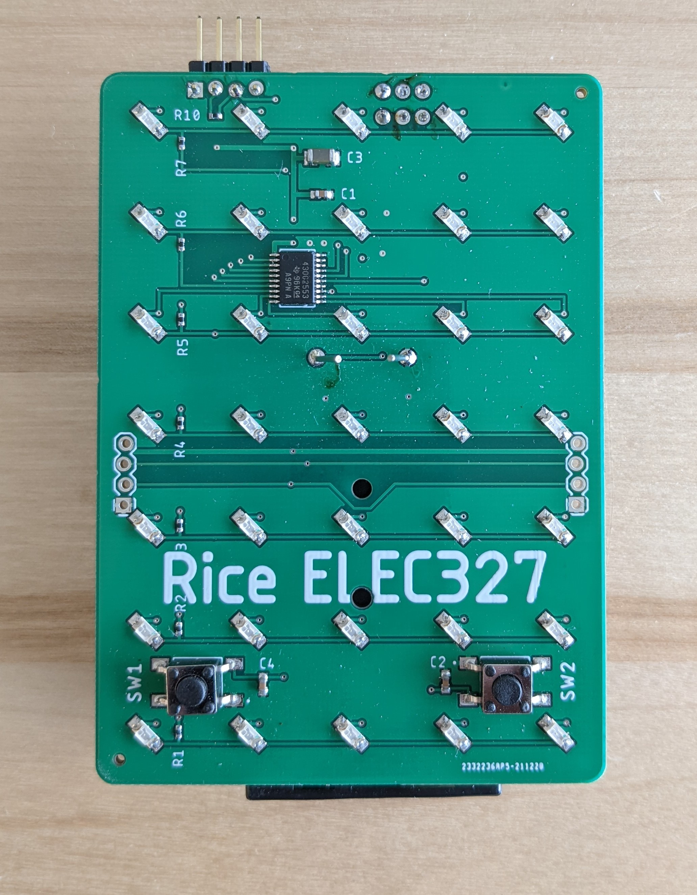

{::options parse_block_html="true" /}

## Lab #3: _Timers, PWM, and Logic_

_The goals of this lab are two-fold. First, we aim for you to continue gaining experience
understanding active and low power modes. Second, the goal is to begin to do more complex software design
involving multiple digital IO pins interacting and multiple interrupts._

_This assignment is due Wednesday, Febrary 8, 2023._

<figure class="figure">

<figcaption class="figure-caption">
Lab 3 35-LED display PCB.
</figcaption>

</figure>

The PCB has been largely pre-soldered for you, but you will need to attach the LED module and a programming header. 
If you want to add the battery pack or side-connection headers, you can also do that. 

In order to do the lab, you will need to reference the [board](Display-2023.brd) and/or [schematic](Display-2023.sch)
files in order to know how the LEDs are connected to the MSP430. These PCB design files are done in
EAGLE cad, which you can download from the Autodesk website for free. You will need to learn how to
use this software later in the course, so it's a good idea to begin familiarizing yourself with it.
In the meantime, a screen shot of the schematic can also be found [here](Schematic P1.png).

1. **(Not scored!)** Either examine the PCB closely or look at the schematic for the display. Which GPIO pins
are connected to LEDs?

2. **(Not scored!)** In a normal, canonical (i.e., atomic), forward operating (i.e., not-breaking-down) diode,
which terminal does positive (conventional) current flow out of, cathode or anode? In the
display circuit, which pin(s) is this terminal connected to?

3. **(Not scored!)** What values for the rows and columns (0 or 1) will result in the bottom left
and top right diodes turning on?
{: class="questions"}

Precise modeling of the current/voltage characteristic of a diode is complicated, but
important for a number of applications (such as detecting light with a photo diode). A
very simple model of a diode switches from infinite resistance to zero resistance at the
"threshold voltage". Thus, when on, the current through the diode must be limited. A resistor
in series with the diode serves to limit the current, and you will see such a resistor in the
display schematic. In order to find the proper value of this resistance, you need to know
something about the LED and also something about the rest of the circuit.

<!--
4. **(Not scored!)** Use a multimeter in lab to measure the threshold voltage of the supplied
LEDs.  How does this compare to the "forward voltage" found in the
[datasheet](http://www.digikey.com/product-detail/en/LTST-C150KRKT/160-1405-1-ND/386760). Why
might they be different if they are?

5. **(Not scored!)** Further examining the datasheet, what is the maximum value of forward current that you
should apply? What appears to be the recommended forward current level?

6. **(Not scored!)** Assume that you will be using one a CR2032 battery, which has a nominal voltage of 3V. What
voltage will appear on the output of the LED drive pins when they are on? (You can ignore the
voltage drop through the MSP430!).

7. **(Not Scored!)** Measure the voltage of a new AAA battery - what voltage do you find? After you build the circuit
and program the display, measure again with the device running off 2 AAAs. What value do you find now?

8. **(Not Scored!)** Finally, assume that the threshold voltage of the diode is 2 V, and the MSP430 output pin
voltage is 3 V, and that the desired on current is 5 mA. What value of current-limiting
resistor should you use? What would be the minimum resistance such that the current is less
than the maximum (DC) specified in the data sheet?
{: class="questions" start="4"}

-->

Here is a helpful video:

<iframe width="560" height="315" src="https://www.youtube.com/embed/7B_-qmJLfng"
frameborder="0" allowfullscreen></iframe>

#### Lab Specification

The first part of the design is to implement an incrementing numeric display using the PCB. The
numbers should increment once per second.

<!-- The second part of the lab is to implement a dimming mode. Dimming is implemented using PWM,
with the display switching between off and on rather than just cycling between columns. -->

The final part of the lab is that you should have another variable that determines whether your PCB is
displaying the numbers 0-2 (i.e., hours), the numbers 0-6 (i.e., tens of minutes or seconds), or the
numbers 0-9.

**Save your code as `display.c`. You will need to demonstrate your device running and walk
through your code comments and modifications for one of the course staff by the due date.
Upload your answered questions to the Google doc, and the code to Canvas.**

#### Details

Pursuant to helping you doing the lab, the [skeleton code](lab3_skeleton.c) will set up the MSP430
so that the ACLK is being driven by the VLO (which you remember runs ~12 kHz), and TimerA0 is being
driven by the ACLK. **These two conditions are required for the Timer to continue to function when the
device is in LPM3 (CPU and DCO off!).** The display PCB is designed as a matrix - each LED is
addressed by a row and a column. Each row and column in turn are connected to a GPIO pin: the rows
are connected to P1.0 - P1.6 and the columns are connected to pins P2.0 - P2.4. If you look at the 
[datasheet](TA20-11GWA-30100.pdf) for the LED array, you'll see that the individual LEDs are set up to 
flow current from the row input to the column out. This means two things: 

First, to turn on an 
individual pixel, the relevant row pin must be set to a high level and the column pin to a low level -- 
the row pin is a __current source__ and the column pin is a __current sink__. To turn off that LED, you
can make both row and column pin have the same level (either high or low) or you can also change
the direction of one of them from input to output.

Second, an arbitrary pattern across the whole display cannot be displayed simultaneously. Rather,
the LEDs will have to be rapidly scanned, and rely on the eye to integrate the result into a static image.

The skeleton code presents a simple design in which the display is operated by cycling through each
column of LEDs, but you'll need to fit in three key pieces for the first specification.

  - The 5x7 font for each number in 0-9. Each column is stored as the lower 7 bits of a char, **where a 1 corresponds to a pixel off**.
  - The refresh function, which will copy the font to the display a column at a time.
  - The timer interrupt period to achieve one second increments.

<!-- 
9. (This Question **IS** Scored!) Use the Energy Trace software to measure the power consumption of
the display PCB when it is programmed to light one LED per column. Change the two lines of code that
enter and exit LPM3 to instead enter and exit LPM0. What is the difference in averge current
consumed? What is the primary culprit for the residual current in LPM3? (Why does it still consume
so much current?)

10. (This Question **IS** Scored!) Return the code to go in and out of LPM3. Now change the code
so that each cycle an entire column is lit (commenting line 31 and uncommenting line 30). How much
current is consumed on average now? Change the code so that only 4 LEDs are lit each cycle. Can you
estimate a linear relationship between the number of LEDs used and the current consumption? What is
the slope (in units of mA per LED)? What is the intercept? What is responsible for the intercept?
{: class="questions" start="9"}
-->

