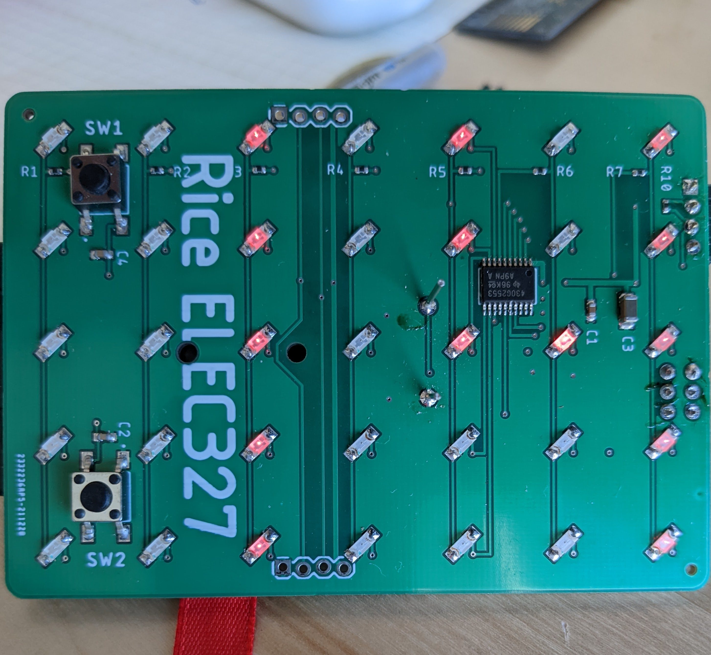

{::options parse_block_html="true" /}

## Lab #5: Processing Button Presses and Code Logic

_This lab focuses on thinking about a state machine to process user input._

#### What should be turned in on Canvas?

  1. Your **commented** `main.c`, `Numbers.h`, and `Numbers.c` files. Specifically, the comments
  should include any instructions that peer graders might need to compile and run your code. Please
  include the proper interrupt compiler directives to ensure that both the TI and gcc compilers will
  work.

  2. Answers to the questions in a text or otherwise broadly-accessible format.

#### The lab will be due February 18, 2022 at 11:59 PM. 

<figure class="figure">

<figcaption class="figure-caption">
Display PCB showing a 2 digit number.
</figcaption>
</figure>

#### Process buttons to make a timer

A kitchen timer has two important modes - countdown timing mode and set-the-time mode. Your job is
to implement a seconds counter using your Lab 3 PCBs. Template code is provided to help you out a
bit: [main.c](https://github.com/ckemere/ELEC327/raw/master/Labs/Lab5/main.c),
[Numbers.h](https://github.com/ckemere/ELEC327/raw/master/Labs/Lab5/Numbers.h), and
[Numbers.c](https://github.com/ckemere/ELEC327/raw/master/Labs/Lab5/Numbers.c). You'll want to make
a new CCS project and add all three of these files.

##### What has been given you:
The example code counts upwards from 01 to 99. Pressing one or both of the buttons will pause the
counting. The `Numbers.*` files implement a module for displaying numbers. It provides two
functions, `initialize_display()` and `display_number(int number)`. The `main.c` code calls these to
interface with the display. If you look in the `Numbers.h` header file, you'll see that it tells you
that the module uses TimerA1 and certain pins in P1 and P2. *This is a good model to follow! It took
a fair bit of care to make sure that all P1/P2 values were never explicitly set, only modified, so
that other parts of the system could make use of other pins.* 

Looking at the main loop, currently, what happens is that the second timer (which uses the TimerA0
module) and watchdog timer wake up the loop. The loop checks what the wakeup event was, and if it
was the second timer, proceeds to update the display. But display update happens only if neither
button is currently depressed.

There is a large comment that specifies your task for the lab. You will replace this with your own
logic to process button presses. The timer should enter or exit "time-setting-mode" if the user
pushes both buttons together (the mode change should happen on button release!). In
"time-setting-mode", button Sw1 should increment the time and SW2 should decrement it. Holding down
the buttons should result in continuous (but controlled) changing of the values. **Bonus:** Make the
numbers flash when the device is in "time-setting-mode." In counting mode, the timer should count
down to zero and then stop.

**Hint:** You'll need some sort of state machine to keep track of whether you're in (A) timing mode (counting
down) or (B) in setting mode. What happens inside the while loop will depend on this mode. In
"time-setting-mode", you want to check whether a single button is depressed and update the display
accordingly. In the special case where both buttons are depressed at once, you want to wait until
one of them is released (loop around until true!) and then switch modes. In countdown mode, you need
to check for both buttons being pressed (temporary state) and then released (switch modes).
Otherwise, you just decrement the timer value every second until it is zero.

**Hint 2:** Remember that the ports are active low. Also remember that if you're checking a for a
button to be pressed, you're asking whether, e.g.,  `P1IN & 0x80 == 0` or `P1IN & 0x80 == 0x80`
(tricky because it's not `== 1`!!!). 

