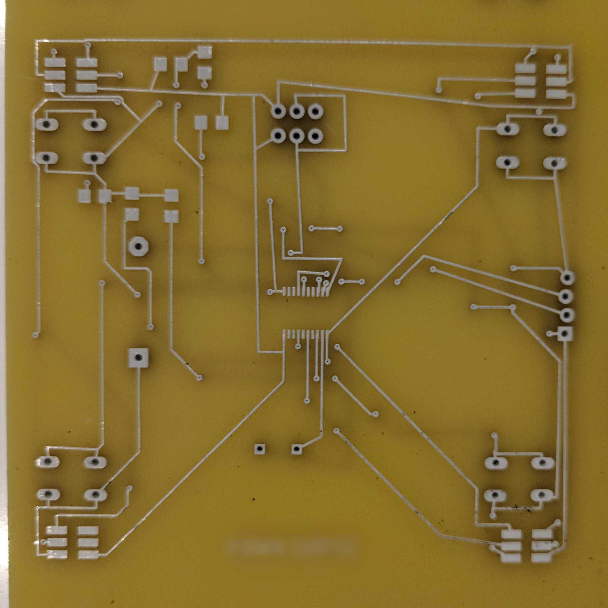
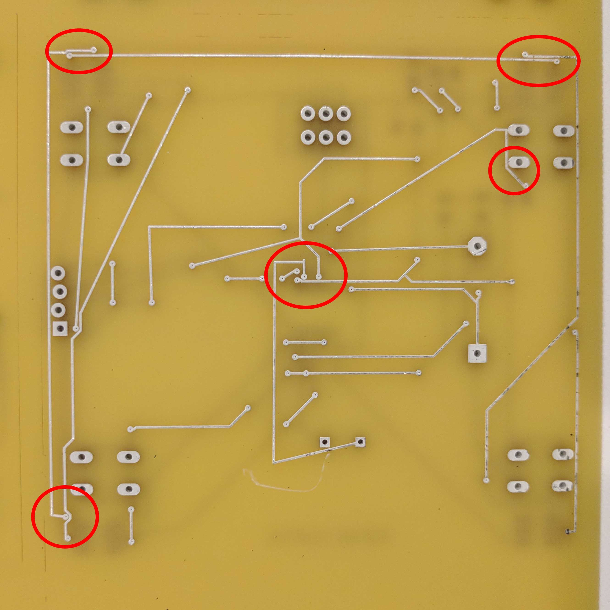

{::options parse_block_html="true" /}

### Lab #5: PCB Design With KiCAD (100 pts)

#### **There is one goal for this assignment:**

  - To learn how to design a PCB
  

#### Due Date: 2/27/2025
#### What should be turned in?

  1. Just the KiCAD `.kicad_pcb` file for your design. (_Canvas_)

#### How will you be assessed?
  - We will run DRC on the individual PCB layout files, and should not find errors.
  - We will look for your initials to be on either the top or bottom copper layers.
  - We will measure the board area. If it is less than 3 square inches, you will receive full credit.
  - We will give bonus points for tileable PCBs that have less than this minimum area.

#### Designing a RGB Trinket PCB

For this lab, you have the choice of making a PCB design with "through hole" components

You will likely find useful to clone the [ELEC327 reposistory](https://github.com/ckemere/ELEC327) from
GitHub (if you have not done so yet). In the `PCBs/ELEC327-Library` subdirectory, there are KiCAD symbol and 
footprint libraries that you should add to your Symbols and Footprints libraries.

Your task is to design a PCB with KiCAD which includes the following parts from the ELEC327 library:
   - A [MSPS003F4](https://www.ti.com/lit/ds/symlink/mspm0c1104.pdf) ([datasheet](mspm0c1104.pdf))
   - Necessary RC filter for NRST pin
   - Power decoupling capacitors
   - A 2032 battery holder
   - One tactile push button 
   - One common anode RGB LED, and 3 current limiting resistors
   - One slide potentiometer
   - One header for programming and debugging (2x5)
   - One buzzer

Starter projects with all the parts can be found in two starter projects:
   - If you want to use mainly 0805 surface mount parts [Lab5_SMD.zip](Lab5_SMD.zip)
   - If you want to use larger 1210 surface mount and through hole parts [Lab5_THT.zip](Lab5_THT.zip)
   - If you want to use a rotational potentiometer [Lab5_SMD_Smaller_Pot.zip](Lab5_SMD_Smaller_Pot.zip)

   - Connect the RGB Led properly so that the RGB LED can be driven by TIMG14 PWM outputs.
   - Connect the Buzzer so that it can be driven by the BEEP output.
   - Connect the slide potentiometer so that the center point can be read out by an ADC input.
   - Put your initials in Text on either the Top or Bottom  (copper) layers.

#### DRC and Manufacturing
To facilitate manufacturing in the Advanced Circuits Barebones process, 
[AdvancedCircuits_8mil.zip](AdvancedCircuits_8mil.zip) contains a minimal KiCAD project that
sets the appropriate layers as well as "Design Rule Check" (DRC) rules. The DRC rules include that
the minimum sizes for traces and spacing is "8 mil" (0.008 inches), and the minimum drill size is
"10 mil". You can set these rules for your PCB by doing the following:
  - Unzip the AdvancedCircuits project.
  - Open your project, and open the PCB in the PCB editor.
  - Select the "Board Setup" option from the "File" menu.
  - At the bottom of the dialog box, there is an option to "Import Settings From Another Board".
  - In the resulting dialog, select the AdvancedCircuits_8mil pcb that you have unzipped
  - Click on the "Select All" option in the bottom left corner, and then "Import Settings".

<!--
Eagle comes with a good number of parts, but not all that you need. You can either
create a personal library for parts you make or add them to the ELEC327 library. Once you have
created/opened the library, start with the "symbol". Make sure to adequately labels the various
connections.  For reference, note that Digikey may provide an Eagle part design for the deisgn using an "Ultralibrarian"
script or a SnapEDA file. Feel free to make use of these, but you MUST DOUBLE CHECK the
design!!!! You shouldn't need to do this for this lab.

Next, then create a `.brd` file and route all of the connections. Keep in mind that the
battery package is solid and plastic, so you should not place any parts on top of it. One
solution is to put everything but the battery on one side of the PCB and the battery on the
other. Try to make the final board approximately square/circular, with a diameter of 20-40 mm.
After routing, check to make sure that it passes the electrical rule check (ERC) and design rule
check (DRC), using the DRC rules given in the `PCBS/AdvancedCircuitsBarebones.dru` rule file in the
github repository.

-->

After you place your components and route traces, please put your initials or some other
identifying mark on the board **on either the top or bottom copper layer** (since this is a
barebones process, there is no silkscreen).{: style="text-decoration:underline"}

When you're finished, if you're interested in seeing what manufacturing files look like, you can generate them.
To generate the manufacturing files:
  - Select "File Menu"->"Fabrication Outputs"->"Gerbers (.gbr)"
  - Click "Plot" to generate three "Gerber" files (for our PCBs, these describe the copper layers and the board outline)
  - Note that for the panel, we will check the "Disable aperture macros" option, and uncheck the "Include netlist options",
    but if you do fabrication elsewhere, these options are likely acceptable.
  - Click the "Generate Drill Files..." button.
  - Note that for the panel, we will select the "PTH and NPTH in a single file", "Use alternate drill mode", and "Keep Zeros"
    options.

### Turning in
We will submit a panel of the class's designs for manufacturing, and in a subsequent lab, you will assemble 
and test your PCBs. Thus, late submissions of this portion of the assignment will mean that you lose 
points not only for this lab but also a subsequent one!!!! We will regenerate the manufacturing files from
your PCB files, so the only thing you need to submit is the `.kicad_pcb` file from your project.

### PCB Design Patterns and Anti-Patterns

A "Design Pattern" is an approach for a design task that will help you put small steps together
into a full hole. When routing the traces on a PCB, straight lines, symmetry, and right angles
are one possible pattern to follow. Note that this requires not just rotely following a rule -
think about how you will make the routes while placing the components and deciding their
rotation/orientation.

An "Anti-Design Pattern" is the opposite: rules of thumb that end up causing more problems than
they solve. For the PCB example below, I imagine the student placing the components then
thinking, "I will make the routes as straight as possible and introduce only minimal bends when
necessary to avoid vias." The result is a number of places where traces and vias are minimally
separated, or parallel traces travel very closely (minimal separation) for a long distance. A
piece of conductive junk ended up between two traces on this board, causing hours and hours of
confused debugging.

<figure class="figure">

<figcaption class="figure-caption">
Anti-design PCB front
</figcaption>
</figure>

<figure class="figure">

<figcaption class="figure-caption">
Anti-design PCB back
</figcaption>
</figure>

