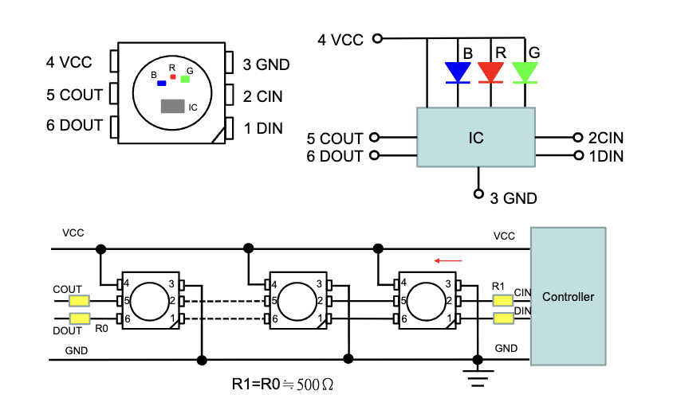
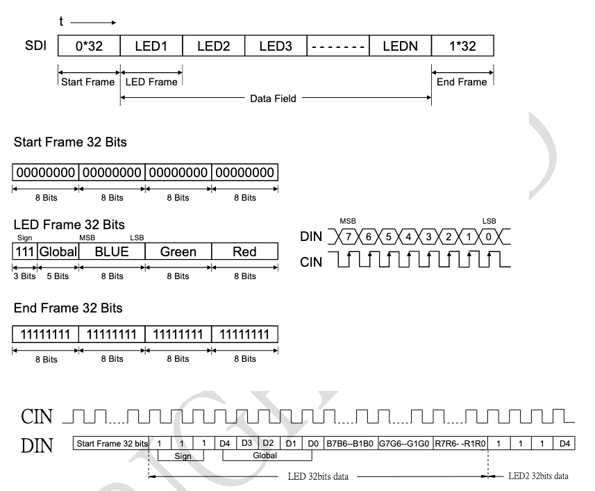

{::options parse_block_html="true" /}

### Lab #6: Serial Communication Protocols (100 pts)

#### **There is one goal for this assignment:**

  - To learn to use serial communication protocols to send and receive information to/from peripherals
  - To build on our previous state machine logic to control RGB LEDs using button presses

  

#### Due Date: 2/328/2025
#### **What should be turned in?**

### Controlling an RGB LED using SPI
The SPI serial protocol is used for high-ish speed synchronous serial communication with many peripherals.
In this lab, we'll be using a special case of an SPI peripheral, one that merely receives data from its
controller, rather than also sending data back. The "APA102C" family of digitally controllable LEDs are
configured in such a way that the control signals can be chained.

<figure class="figure">

<figcaption class="figure-caption">
Chainable SPI RGB LEDs
</figcaption>
</figure>

Internally, each LED works by peeling off the first instruction that is sent to it, then forwarding on
any additional ones. Here's the message encoding system:

<figure class="figure">

<figcaption class="figure-caption">
Protocol for Chainable SPI RGB LEDs
</figcaption>
</figure>

The all-zeros word at the beginning of the data sequence serves to inform the LED 
that an instruction is starting. While it decodes the next word, it forwards on an all-zeros word to the
next LED. Each LED in the chain ends up being one clock cycle delayed from the previous one. Thus the 
final word of all-ones at the end of the data sequence is merely there to ensure that enough clock ticks
are given to drive the final color command all the way to the end of the chain.

While you could fairly easy "bit-bang" this protocol by sending out data bit wise using GPIO commands,
most microcontrollers include hardware Serial Modules that simplify this process for you. The MSPM0+ is
no exception. In general, a hardware serial module works by providing TX (transmit) and RX (receive) 
registers. Once the module is configured and enabled, the data in the TX register is automatically clocked 
out, one bit at a time, while data is simultaneously clocked into the RX register. As described in class,
this is not the end of the story - these registers are usually buffered, so that the firmware can load
the next word to be transmitted into the module while the current word is being transfered (and copy the
previously received word out while the current word is being received). In the MSPM0+, we additonally have
a multi-word FIFO queue that feeds from/to these buffer registers. AND, to top it off, we can load/empty that
queue using DMA. So it is possible to automatically transfer long strings of data without involving the CPU.
For this lab, we will stop at the first buffer layer, but if you reconfigure the code to use the FIFO or 
DMA (without leveraging the Driverlib libraries!!), you can get bonus points.

### Your task for Lab 6
For Lab 6, we are handing out the PCBs that you will use not only for this lab, but also Lab 7 and
the Midterm project. Looking at the PCB, in addition to an MSPM0G3507 in the center, you can see 4 buttons
at the outside corners, and 4 SPI RGB LEDs in a square diagonally aligned with them. Your task for Lab 6
is to configure the PCB such that when you depress one of the buttons, the corresponding LED will light
up. It is strongly suggested that you adopt a state machine structure to achieve this goal!

The schematic for the Simon PCB can be found on the github - [https://github.com/ckemere/ELEC327/tree/master/PCBs/Simon-2025](https://github.com/ckemere/ELEC327/tree/master/PCBs/Simon-2025).
Of critical importance, the GPIOs conneted to the buttons are PA23, PA24, PA25, and PA26.
The [Lab6.zip](Lab6.zip) template Code Composer Studio project helps you out by configuring the GPIO for 
those 4 buttons, as well as 3 modules: 

  - TIMG0 - configured to use the LFCLK for a timer interrupt 
  - SPI0 - configured to connect to the correct pins to control the RGB LEDs on the Simon PCB
  - TIMA1 - configured to drive PWM on the buzzer pin.  (You will use this for Lab 8.) 

In order to program the Simon PCB, remove the 10 jumpers that connect across the top of the Launchpad.
These connect an XDS110 debugging interface at the top of the PCB to the microcontroller at the bottom.
Instead, you need to connect these pins to the Simon PCB. The programming pins are labelled - you will
need to connect `GND`, `VCC`=`3V3`, `NRST`, `SWDIO`, and `SWCLK`. (The other ones we won't connect allow
the debug interface to pass through UART communications to the PC and enable some sort of boot-strap loader.)
The video below shows a jumper cable connecting the Launcpad and a Simon PCB.

<figure class="figure">
<video class="figure-img img-fluid rounded" alt="Pin Mux Table" controls autoplay loop>
<source src="LaunchpadAndSimon.mp4">
</video>
<figcaption class="figure-caption">
Video of Launchpad Connected to Simon PCB
</figcaption>
</figure>

In order to change which LED lights up, you will have to understand the message protocol for these
LEDs, and create different messages (or some sort of message generator function). You may choose
whatever colors you like for each LED. The suggested approach is to increase the frequency
of the TIMG0 interrupt and use this as a kernel tick (i.e. 1x per ms). At each tick, you can check 
the state of the buttons, and change states in a state machine. The LED should light up as soon
as the button is depressed and turn off as soon as it is released. **You may assume that only
one button will be depressed at a time.** (Note that adding extra functionality via multi-button
presses is a bonus option for the midterm project, so you may choose to consider how to do this.)

#### Rubric
You will be graded based on a collection of your peers assessing whether or not the lights are
tracking button presses.

#### Supplemental
Some of you may be interested in doing more with the Simon PCB. The TI-provided "Driverlib" libraries
make it convenient to explore some of the other functions of the MSPM0+. A Driverlib version of the project
template is provided in the [Lab6-Driverlib.zip](Lab6-Driverlib.zip) archive. (Note that it does not
configure PWM for sound.)

